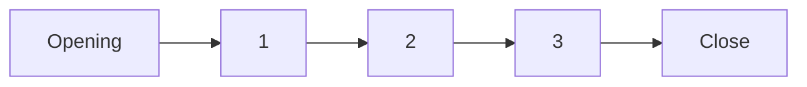
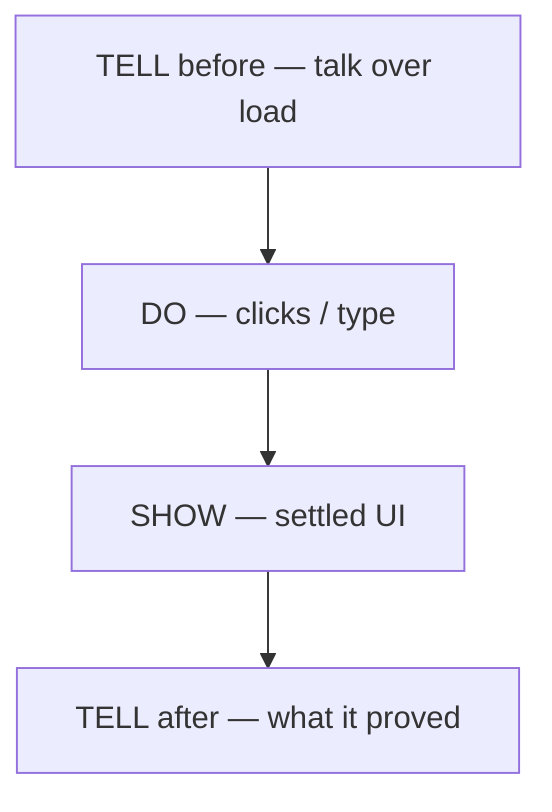
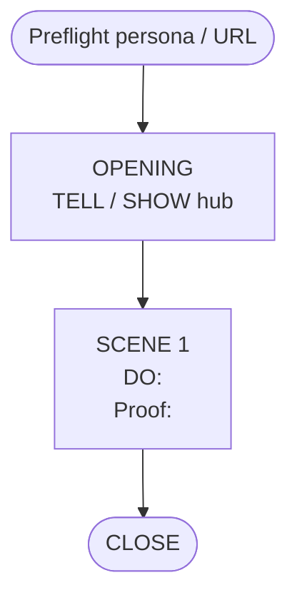

# Storyboard — <title>

Audience journey for the script in `script.md`. Runtime ~N min. Site: <url>.

## 1. Audience journey

## 2. Scene anatomy

## 3. Per-scene board

| # | Screen | Killer move | Proof on screen |
|---|---|---|---|
| 1 | | | |

## 4. Recovery

| What | Do |
|---|---|
| | |
